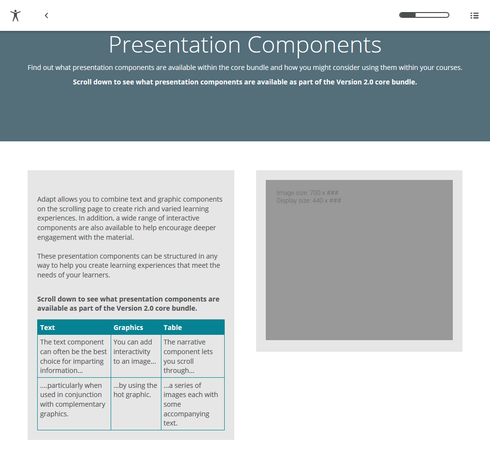

# adapt-simple-table  

**SimpleTable** is a *presentation component* and an extended text comopnent with capability to display text in a table. By adding some attributes in JSON, developer can create table without muddle themself using markup tags. 

### Installation
First, be sure to install the [Adapt Command Line Interface](https://github.com/cajones/adapt-cli), then from the command line run:-

    adapt install simple-table
    
Or, download the ZIP and extract into the src > components directory and run an appropriate Grunt task.

### Attributes

[**core model attributes**](https://github.com/adaptlearning/adapt_framework/wiki/Core-model-attributes): These are inherited by every Adapt component. [Read more](https://github.com/adaptlearning/adapt_framework/wiki/Core-model-attributes).

**_component** (string): This value must be: `simple-table`.

**_classes** (string): CSS class name to be applied to **SimpleTable**’s containing `div`. The class must be predefined in one of the Less files. Separate multiple classes with a space.

**_layout** (string): This defines the horizontal position of the component in the block. Acceptable values are `full`, `left` or `right`.  

**title** (string): A reference title for the component. **title** is distinct from the **displayTitle** which, if present, appears above the component. **title** provides the opportunity to use a shortened form in tighter spaces, such as in menus or in the drawer.  

**displayTitle** (string): Optional text that will display as a title or header above the component. It can be used as a headline.   

**instruction** (string): This optional text appears above the component. It is frequently used to
guide the learner’s interaction with the component.

**body** (string): Although optional, this text constitutes what is thought of as the primary *simple-table* of the **SimpleTable** component. HTML is permitted.

**_header** (string): Header cell.

**_cell** (string): Table cell(s).

**text** (string): Table cell/header text.

<a href="#top">Back to Top</a>

## Limitations

No known limitations. 

----------------------------
**Version number:**  1.0.1 
**Framework versions:** 3+  
**Author / maintainer:** Kunj kunjsharma@hotmail.com  
